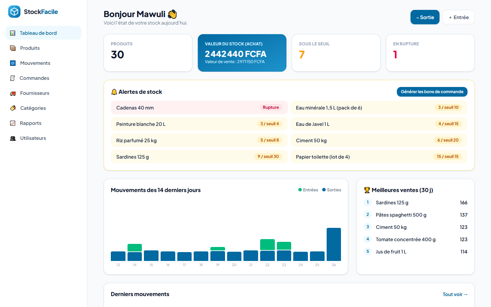
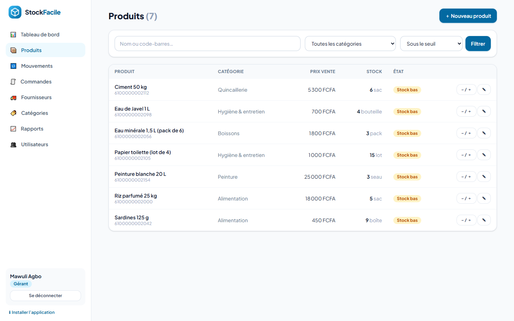
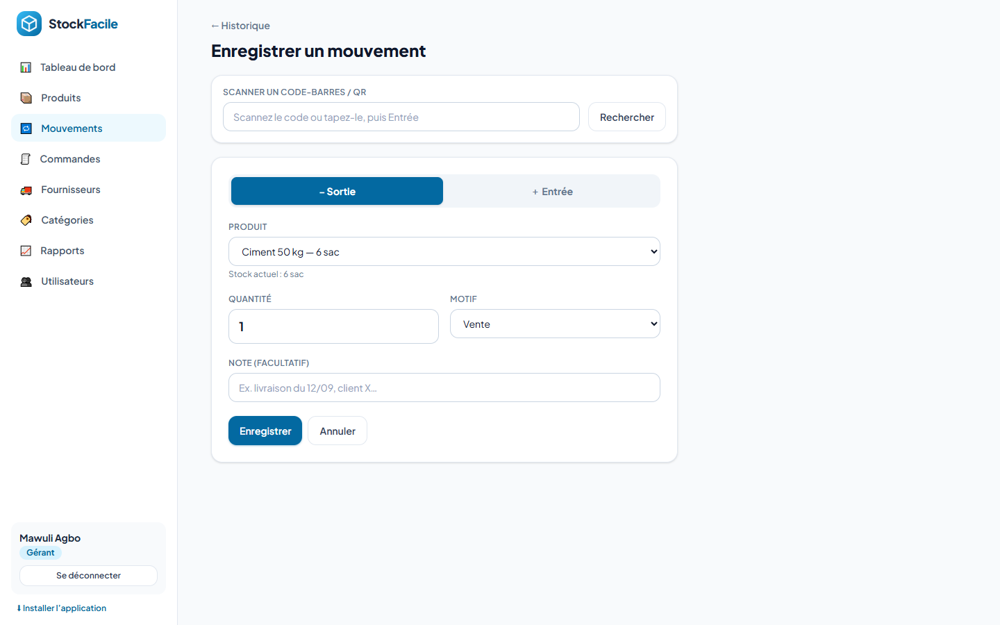

# StockFacile — Gestion de stock pour petite boutique

Application de gestion de stock pour un petit commerce (boutique, quincaillerie, épicerie) : suivi des produits,
des entrées et sorties, alertes de rupture et bons de commande. Projet n°4 du cahier des charges « 9 projets fictifs ».





## Fonctionnalités (MVP)

- Authentification avec **rôles** : gérant et vendeur
- CRUD produits (nom, catégorie, prix d’achat et de vente, quantité, seuil d’alerte, code-barres)
- Enregistrement des **mouvements de stock** (entrée / sortie) avec motif ; une sortie supérieure au stock est refusée
- **Historique complet** des mouvements (filtres par produit, type, période) avec l’utilisateur et le stock après opération
- **Alerte visuelle** quand la quantité passe sous le seuil (orange) ou à zéro (rouge)
- Tableau de bord : valeur totale du stock, produits en rupture, mouvements sur 14 jours, meilleures ventes

## Fonctionnalités avancées (bonus)

- **Permissions par rôle** : le vendeur enregistre les mouvements ; seul le gérant modifie les produits et les prix, voit les rapports, gère les utilisateurs
- **Bons de commande fournisseur** générés automatiquement (produits sous le seuil, regroupés par fournisseur), export PDF, et réception qui met le stock à jour
- **Code-barres / QR** : champ de recherche compatible lecteur USB, pour saisir un mouvement en un scan
- **Rapport mensuel** exportable en **PDF** (DomPDF) ou **Excel** (CSV UTF-8) : chiffre d’affaires, marge, ventes par produit
- Application installable (PWA), interface adaptée mobile

## Stack

| Composant | Technologie |
|---|---|
| Backend | Laravel 12 (Blade) |
| Base de données | MySQL |
| Interface | Tailwind CSS 4 (compilé dans `public/css/app.css`) |
| Export | DomPDF, CSV |
| Environnement local | XAMPP sous Windows |

Modèle de données : `users (role)`, `categories`, `fournisseurs`, `produits (categorie_id, prix_achat, prix, quantite, seuil_alerte)`,
`mouvements (produit_id, type, quantite, motif, stock_apres, user_id)`, `commandes`, `commande_lignes`.

## Installation

```bash
composer install
cp .env.example .env            # renseignez la base MySQL
php artisan key:generate
php artisan migrate --seed      # crée les tables + 30 produits et 30 jours de mouvements de démonstration
php artisan serve
```

CSS (facultatif, déjà compilé) : `npm install && npm run build`. Tests : `php artisan test` (10 tests).

## Comptes de démonstration

| Rôle | E-mail | Mot de passe |
|---|---|---|
| Gérant | `gerant@stockfacile.bj` | `demo1234` |
| Vendeur | `vendeur@stockfacile.bj` | `demo1234` |

Boutique et produits fictifs. Le seeder fournit la base d’exemple préremplie demandée par le cahier des charges.

Auteur : [Sedjame Vianney](https://sedjame-vianney.vercel.app)
